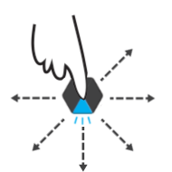

# Havoc (_WIP_) - A game for Blinks, by Move38.

### RULES
| Number of Blinks | Number of Players | Duration of Gameplay | Recommended Ages |
|------------------|:-----------------:|:--------------------:|-----------------:|
| 2 +           | 2 +             |  ~ 2-5 minutes    | 12 & Up          |

Havoc is a physical action game for 2 or more players, based (loosely) on [Egg Jarping](https://en.wikipedia.org/wiki/Egg_tapping).  Players choose between 3 weapons and fight to the death.  Last knight standing is the winner!

#### SETUP
Distribute 1 Havoc Blink to each player, representing that player's "Knight".  Havoc tiles start in the "Forge" state, indicated by a flickering fire animation.  Here, players can press the button to cycle between 3 weapons:

- **Sword** - A single blade, for knights who desire more of a challenge.
- **Axe** - Double-sided blade.  Best for knights joining the battle for the first time.
- **Chakram** - Three blades in a circle, for knights who want more pretection from harm.

  

Players select a weapon for their knight by double clicking, indicating that they are ready for battle.

### GAMEPLAY
When all players have selected their weapons, players place their tiles on a table, resting at least one finger on top to allow free movement.  Players then begin the game by counting down from 3 and yelling ***"CHARGE!"*** (or a battlecry of their choosing).

Players move their blink around on the table, trying to stab/slash/cleave the other players blinks.  If a "blade" face makes contact with another blinks "empty" face, the receiving blink takes damage.  When a blink recieves 3 hits, it is pronounced "dead" (indicated by turning fully red) and that knight is knocked out of the round.

  
  

### WIN CONDITION
The winner of the round is the last player to keep their knight alive.
